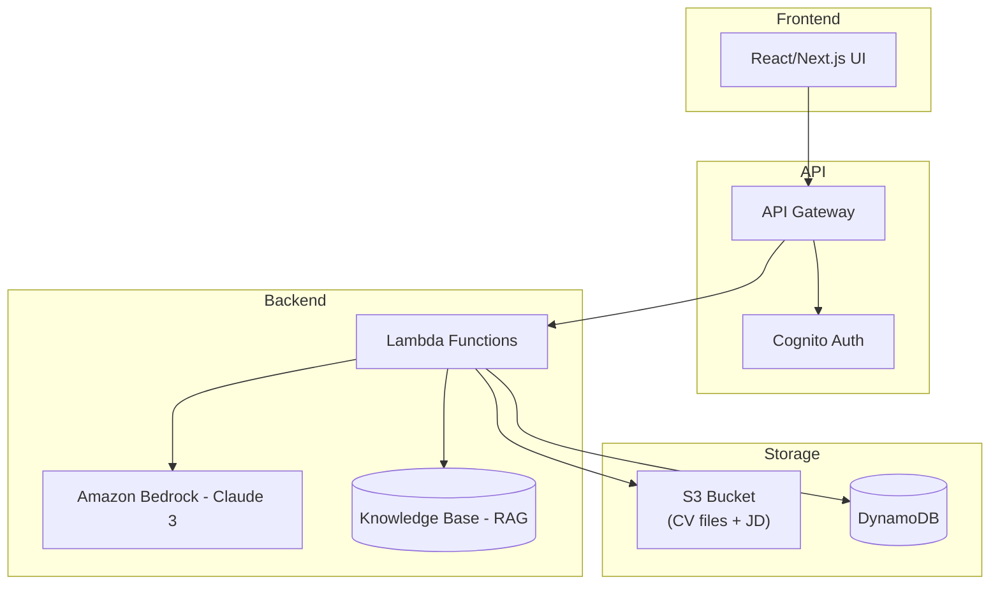

## KIẾN TRÚC DIAGRAM

**Luồng chính:**

1. User upload CV → S3

2. Lambda trigger → Extract text (Textract hoặc PDF parser)

3. Gọi Bedrock với Prompt Engineering + RAG

4. Lưu kết quả vào DynamoDB

5. Trả báo cáo về Frontend
